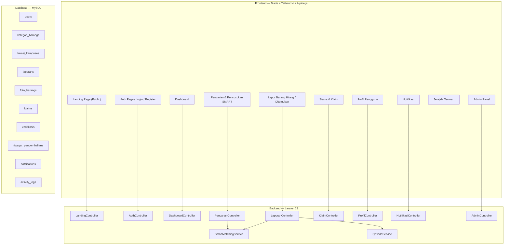

# 🏗️ FinderCampus — Implementation Plan & Progress Tracking

## 📌 Progress Status (Terakhir Di-update)

- [x] **Fase 1: Foundation & Setup** (SELESAI ✅)
  - Layout (`app`, `guest`), Navbar, Footer, Components (`item-card`, `status-badge`, `breadcrumb`).
  - Tailwind CSS 4 theme + Alpine.js integrated + Vite build config.
- [x] **Fase 2: Database Schema & Models** (SELESAI ✅)
  - All migrations (`users`, `laporans`, `kategori_barangs`, `lokasi_kampuses`, `foto_barangs`, `klaims`, `verifikasis`, `riwayat_pengembalians`, `activity_logs`, `notifications`).
  - Models with relationships & fillable attributes.
  - Seeders (`KategoriBarangSeeder`, `LokasiKampusSeeder`, `AdminSeeder`, `DemoDataSeeder`) & successfully migrated/seeded.
- [x] **Fase 3: Authentication (Login, Register & Dashboard)** (SELESAI ✅)
  - `LoginController`, `RegisterController`, `LoginRequest`, `RegisterRequest`.
  - Views for `auth/login.blade.php`, `auth/register.blade.php`, `dashboard.blade.php`.
  - Routes in `routes/web.php` for Auth & Guest flow.
- [ ] **Fase 4: Landing Page, Dashboard & Profil** (SELANJUTNYA 🔜)
- [ ] **Fase 5: Pelaporan Barang (Hilang & Ditemukan)**
- [ ] **Fase 6: Pencarian & Pencocokan SMART (Algoritma Core)**
- [ ] **Fase 7: Klaim, Status & Notifikasi**
- [ ] **Fase 8: Admin Panel + Verifikasi**
- [ ] **Fase 9: Polishing, Export PDF & Scheduled Command**

---

## 🎯 Goal

Membangun **FinderCampus**: Sistem Informasi Manajemen Lost & Found Terpusat Berbasis Web untuk area kampus, dengan fitur pelaporan barang hilang/ditemukan, pencarian & pencocokan otomatis menggunakan algoritma **SMART** (Simple Multi-Attribute Rating Technique), pengajuan klaim, verifikasi admin, dan pencatatan riwayat pengembalian.

**Stack**: Laravel 13 + Vite + Tailwind CSS 4 + Alpine.js + MySQL (Laragon) + Node.js

---

## ❓ Decision / Open Questions Confirmation

1. **Notifikasi**: Polling berbasis database (cek notif per reload / AJAX ringan).
2. **WhatsApp Direct Chat**: Menggunakan persetujuan consent/toggle di profil user (`whatsapp_visible`).
3. **Format QR Code**: Gambar biasa (PNG).
4. **Seed Data**: 5 item dummy untuk peragaan awal.

---

## 🏛️ Arsitektur Sistem

---

## 📦 Detail Pekerjaan Per Fase

### Fase 4: Landing Page, Dashboard & Profil (SELANJUTNYA)
- `LandingController.php` & `resources/views/landing.blade.php`
- `ProfilController.php` & `resources/views/profil/show.blade.php`, `resources/views/profil/edit.blade.php`
- Toggle `whatsapp_visible` & Upload avatar user
- Halaman Syarat & Ketentuan, Kebijakan Privasi, Panduan SMART

### Fase 5: Pelaporan Barang (Hilang & Ditemukan)
- `LaporanController.php`, `StoreLaporanRequest.php`, `UpdateLaporanRequest.php`
- `QrCodeService.php`
- `resources/views/laporan/create.blade.php` (Form multi-section + drag-drop photo)
- `resources/views/laporan/show.blade.php` (Detail + QR + Activity Timeline)
- `resources/views/laporan/index.blade.php` (Katalog publik)

### Fase 6: Pencarian & Pencocokan SMART (Algoritma Core)
- `SmartMatchingService.php`:
  - Bobot: Kategori (25%), Lokasi (25%), Waktu (20%), Ciri (20%), Warna (10%)
  - Utilitas $U_{ij}$ ($0.00 \rightarrow 1.00$)
  - Skor SMART $U_i = \sum (W_j \times U_{ij})$
- `PencarianController.php` & `resources/views/pencarian/index.blade.php`
- Radar Notifikasi trigger

### Fase 7: Klaim, Status & Notifikasi
- `KlaimController.php`, `StatusController.php`, `NotifikasiController.php`
- Classes Notifications (Match, Klaim, Verifikasi, Return)
- Views `klaim/create`, `klaim/show`, `status/index`, `notifikasi/index`

### Fase 8: Admin Panel + Verifikasi
- Admin Controllers & Middleware `EnsureAdmin`
- Admin Layout & Views (Verifikasi klaim, manajemen laporan & user)

### Fase 9: Polishing, Export PDF & Scheduled Command
- Auto-expire laporan (Scheduled Command)
- PDF Export bukti pengembalian
- Testing & Finalizing
